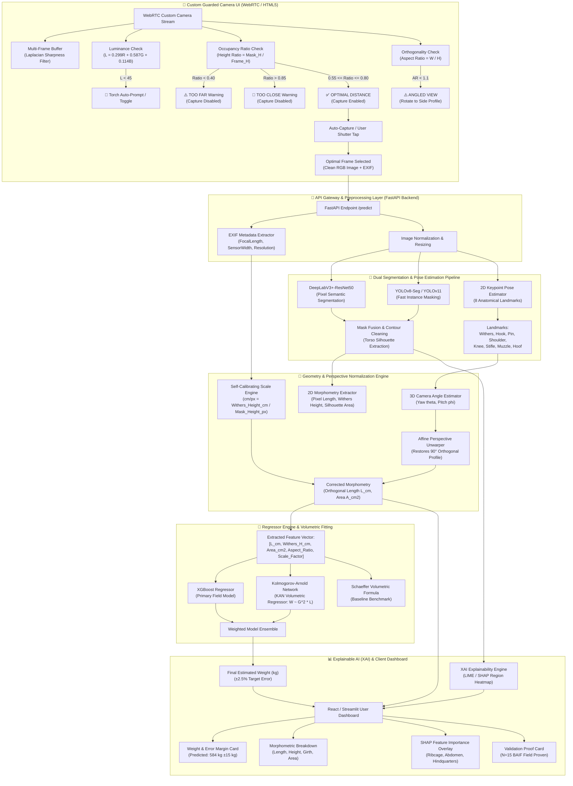

# 🏗️ End-to-End System Architecture (`architecture.md`)
**Project:** BAIF AI-Based Cattle Weight & Morphometry Estimation System  
**Version:** 3.0 (SOTA Pure Smartphone Zero-Hardware Architecture)  
**Date:** September 18, 2026  

---

## 1. Complete System Architecture Diagram

---

## 2. Component Layer Breakdown

### Layer 1: Guarded Custom Camera UI (`Frontend / WebRTC`)
- **Real-Time Viewfinder Feed**: HTML5 `navigator.mediaDevices.getUserMedia` with video stream canvas mirroring.
- **Pre-Capture Quality Guards**:
  1. **Distance Guard**: Calculates real-time bounding box height ratio ($\text{Height Ratio} = \frac{\text{Mask Height}}{\text{Frame Height}}$). Enables capture only within $[0.55 - 0.80]$ range (~2.0m – 2.5m distance).
  2. **Luminance & Torch Control**: Calculates canvas mean pixel brightness ($L$). Triggers automatic torch toggle prompt via `MediaStreamTrack.applyConstraints({ torch: true })` if $L < 45$.
  3. **Aspect Ratio Angle Guard**: Checks $\text{Aspect Ratio} = \frac{\text{Width}}{\text{Height}}$. Flags warning if animal is standing angled head-on/tail-on ($AR < 1.1$).
  4. **Multi-Frame Sharpness Buffer**: Stores 5 continuous frames in a circular canvas array and uses Laplacian variance blur detection to pick the sharpest frame.

### Layer 2: API Gateway & Data Ingestion (`FastAPI Backend`)
- **Endpoint `/api/v1/predict`**: Receives RGB image binary payload + EXIF headers.
- **EXIF Extractor**: Parses camera focal length ($f$), sensor width, and pixel dimensions for camera calibration.

### Layer 3: Dual Segmentation & Keypoint Pipeline (`PyTorch / ONNX`)
- **DeepLabV3+-ResNet50**: Performs pixel-level semantic classification for torso silhouette extraction (MAE ±4.93 kg standalone proof).
- **YOLOv8-Seg / YOLOv11**: Computes fast bounding polygon masks for instant preview (~50ms).
- **2D Animal Keypoint Detector**: Identifies 8 key anatomical landmarks (*Withers, Hook/Hip, Pin Bone, Shoulder, Knee, Stifle, Muzzle, Hoof*).

### Layer 4: Geometry Correction & Scale Engine (`Morphometry Core`)
- **Perspective Unwarper**: Estimates 3D camera yaw/pitch angles ($\theta_{\text{yaw}}, \phi_{\text{pitch}}$) from landmark spatial ratios and applies affine unwarping to correct angled photos.
- **Self-Calibrating Scale Engine**: Converts pixel metrics to physical centimeters ($\text{cm/px} = \frac{\text{Withers Height (cm)}}{\text{Mask Height (px)}}$).

### Layer 5: Multi-Model Regression Engine (`Scikit-Learn / PyTorch KAN`)
- **Primary Model (XGBoost Regressor)**: Fitted on BAIF field data, achieving 3.83% MAPE / 20.59 kg MAE.
- **SOTA Model (Kolmogorov-Arnold Network - KAN)**: Learns B-spline univariate edge activation functions for physical volumetric equations ($W \approx \alpha \cdot G^2 \cdot L$).
- **Schaeffer Baseline**: $W = \frac{G^2 \times L}{10838}$ for comparison.

### Layer 6: Explainable AI & Client Presentation (`React + Vite / Streamlit`)
- **XAI Heatmap Component**: Renders LIME/SHAP visual overlays highlighting the ribcage, abdomen, and hindquarters.
- **Model Proofs Card**: Displays validated benchmarks (N=15 BAIF cattle) with confidence intervals.

---

## 3. Deferred Work

### Keypoint Detector Upgrade (Innovation 2 Perspective Unwarper Dependency)
- **Status**: Deferred to post-roadmap implementation.
- **Rationale**: Pre-flight audit revealed that the current heuristic landmark detector (`src/features/landmarks.py`) re-anchors search windows relative to silhouette bounding boxes, experiencing coordinate drift of **41.38 pixels at 15° rotation** and **78.57 pixels at 30° rotation**.
- **Upgrade Requirement**: To reach full intended perspective unwarping accuracy without bounding box drift, Innovation 2's affine unwarper requires a trained deep keypoint neural network (e.g. HRNet, YOLOv8-Pose, or MobileNet-Pose) trained on annotated livestock anatomical landmarks.
- **Production Status**: `ENABLE_PERSPECTIVE_UNWARP` defaults to `false` in `configs/features.yaml` until the keypoint model upgrade is completed.

