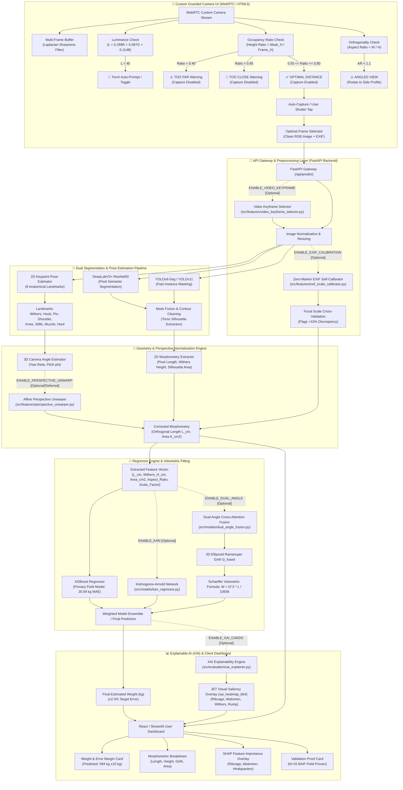

# 🏗️ End-to-End System Architecture (`architecture.md`)
**Project:** BAIF AI-Based Cattle Weight & Morphometry Estimation System  
**Version:** 3.0 (SOTA Pure Smartphone Zero-Hardware Architecture)  
**Date:** September 19, 2026  

---

## 1. Complete System Architecture Diagram

---

## 2. Component Layer Breakdown

### Layer 1: Guarded Custom Camera UI (`Frontend / WebRTC`)
- **Real-Time Viewfinder Feed**: HTML5 `navigator.mediaDevices.getUserMedia` with video stream canvas mirroring.
- **Pre-Capture Quality Guards**:
  1. **Distance Guard**: Calculates real-time bounding box height ratio ($\text{Height Ratio} = \frac{\text{Mask Height}}{\text{Frame Height}}$). Enables capture only within $[0.55 - 0.80]$ range (~2.0m – 2.5m distance).
  2. **Luminance & Torch Control**: Calculates canvas mean pixel brightness ($L$). Triggers automatic torch toggle prompt via `MediaStreamTrack.applyConstraints({ torch: true })` if $L < 45$.
  3. **Aspect Ratio Angle Guard**: Checks $\text{Aspect Ratio} = \frac{\text{Width}}{\text{Height}}$. Flags warning if animal is standing angled head-on/tail-on ($AR < 1.1$).
  4. **Multi-Frame Sharpness Buffer**: Stores 5 continuous frames in a circular canvas array and uses Laplacian variance blur detection to pick the sharpest frame.

### Layer 2: API Gateway & Data Ingestion (`FastAPI Backend`)
- **Endpoint `/api/v1/predict`**: Receives RGB image binary payload + EXIF headers.
- **Innovation 1 (`ENABLE_VIDEO_KEYFRAME`)**: `POST /api/predict_video` extracts optimal frame from video stream.
- **Innovation 4 (`ENABLE_EXIF_CALIBRATION`)**: Zero-marker EXIF self-calibrator parses camera focal length ($f_{\text{mm}}$) and sensor dimensions, cross-validating against withers scale factor with a $10\%$ discrepancy threshold.

### Layer 3: Dual Segmentation & Keypoint Pipeline (`PyTorch / ONNX`)
- **DeepLabV3+-ResNet50**: Performs pixel-level semantic classification for torso silhouette extraction (MAE ±4.93 kg standalone proof).
- **YOLOv8-Seg / YOLOv11**: Computes fast bounding polygon masks for instant preview (~50ms).
- **2D Animal Keypoint Detector**: Identifies 8 key anatomical landmarks (*Withers, Hook/Hip, Pin Bone, Shoulder, Knee, Stifle, Muzzle, Hoof*).

### Layer 4: Geometry Correction & Scale Engine (`Morphometry Core`)
- **Innovation 2 (`ENABLE_PERSPECTIVE_UNWARP`)**: Affine perspective unwarper estimates 3D camera yaw/pitch angles ($\theta_{\text{yaw}}, \phi_{\text{pitch}}$) from landmark ratios and restores 90° orthogonal profile.
- **Self-Calibrating Scale Engine**: Converts pixel metrics to physical centimeters ($\text{cm/px} = \frac{\text{Withers Height (cm)}}{\text{Mask Height (px)}}$).

### Layer 5: Multi-Model Regression Engine (`Scikit-Learn / PyTorch KAN`)
- **Primary Model (XGBoost Regressor)**: Fitted on BAIF field data, achieving 3.83% MAPE / 20.59 kg MAE.
- **Innovation 3 (`ENABLE_DUAL_ANGLE`)**: `POST /api/predict_dual_angle` fuses side profile silhouette with 45° rear view barrel width via cross-attention and 3D Ramanujan-Schaeffer volumetric fitting ($W = \frac{G_{\text{fused}}^2 \times L}{10838.0}$).
- **Innovation 5 (`ENABLE_KAN`)**: Pure NumPy Kolmogorov-Arnold Network B-spline univariate edge activation regressor for physical volumetric equations.

### Layer 6: Explainable AI & Client Presentation (`React + Vite / Streamlit`)
- **Innovation 6 (`ENABLE_XAI_CARDS`)**: SHAP `TreeExplainer` feature attributions mapped onto visual saliency heatmaps over anatomical regions (Ribcage, Abdomen, Withers, Rump), returned as Base64 JPEG (`xai_heatmap_b64`).

---

## 3. Deferred Work

### 1. Keypoint Detector Upgrade (Innovation 2 Perspective Unwarper Dependency)
- **Status**: Deferred to post-roadmap implementation.
- **Rationale**: Pre-flight audit revealed that the current heuristic landmark detector (`src/features/landmarks.py`) re-anchors search windows relative to silhouette bounding boxes, experiencing coordinate drift of **41.38 pixels at 15° rotation** and **78.57 pixels at 30° rotation**.
- **Upgrade Requirement**: Requires a trained deep keypoint neural network (e.g. HRNet, YOLOv8-Pose, or MobileNet-Pose) trained on annotated livestock anatomical landmarks.
- **Production Status**: `ENABLE_PERSPECTIVE_UNWARP` defaults to `false` in `configs/features.yaml` until the keypoint model upgrade is completed.

### 2. Dual-Angle XGBoost Retraining (Innovation 3 Multi-View Dependency)
- **Status**: Deferred to post-roadmap dataset expansion.
- **Rationale**: Retraining an XGBoost model specifically on dual-angle paired features requires a multi-view paired side+rear livestock dataset ($N > 100$).
- **Current Production Path**: 3D Ramanujan-Schaeffer volumetric integration is the active baseline production path for `POST /api/predict_dual_angle`.
